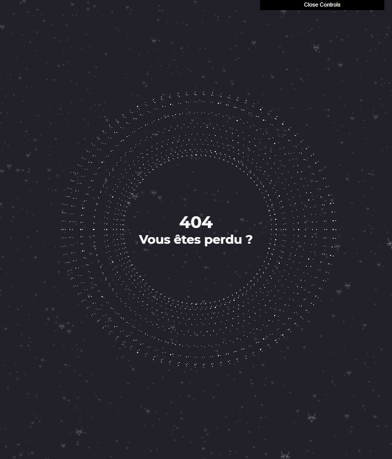
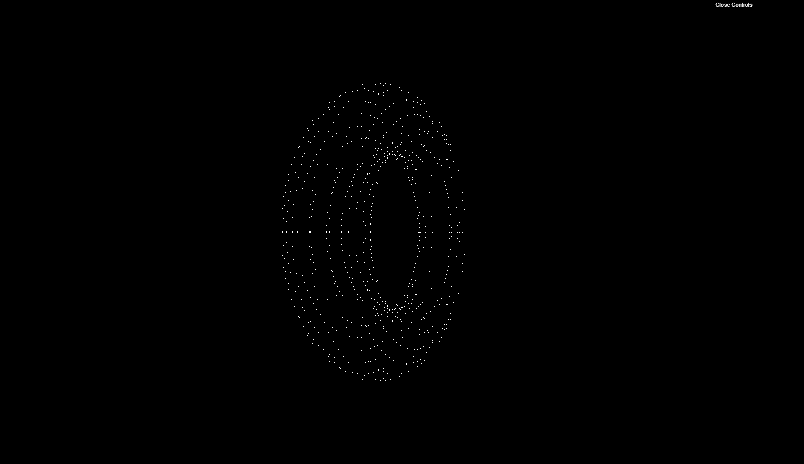
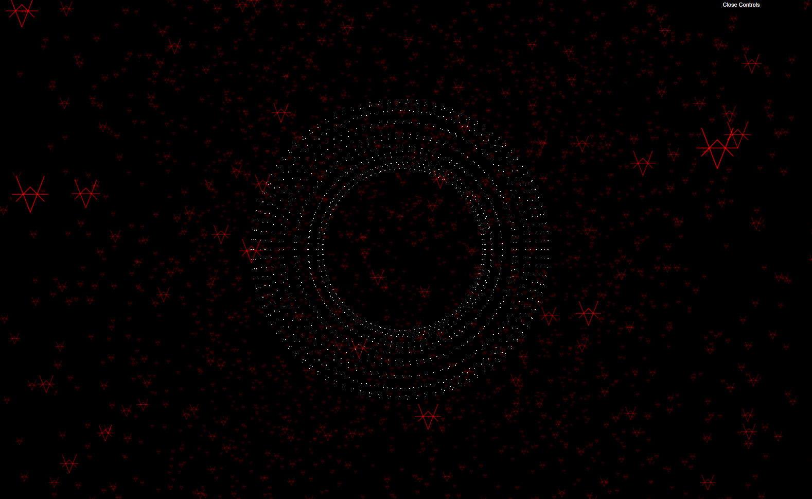

# THREE.js ParticulesSystem

This is some information to remeber to create particules system in threee.js

Visual of this commit :


## Basics

#### Basic Particules object set up 
```js
const geometry = new THREE.TorusGeometry( .7, .2, 16, 100 );
//                          👇
const material = new THREE.PointsMaterial({
    size : 0.005
})

// Mesh                 👇
const sphere = new THREE.Points(geometry,material)
scene.add(sphere)
```


#### Particules textureLoader

 1. We create a BufferGeometry : [BufferGeometry](https://threejs.org/docs/#api/en/core/BufferGeometry)  
 2. A const where we put the amount of particules we want to use, 
 3. We create another const  with "new Float32Array", it will create an array of float
 4. With the "random" method we place all the particules in random position 
```js
// Loading the texture
const loader = new THREE.TextureLoader();
const logo =  loader.load('./filePath/logo.png');

const particulesGeometry = new THREE.BufferGeometry;
const particulesCount = 5000;

const posArray = new Float32Array(particulesCount * 3);

for( let i = 0; i < particulesCount * 3; i++ ){
    posArray[i] = (Math.random() - 0.5)  * 5 ;
    // posArray[i] = (Math.random() - 0.5) * (Math.random() - 0.5) * 5 ;
}

particulesGeometry.setAttribute( 'position', new THREE.BufferAttribute(posArray, 3));

const paticulesMaterial = new THREE.PointsMaterial({
    size : 0.05,
    map: logo,
    transparent:true,
    // color: "red",
    // blending: THREE.AdditiveBlending
});

const particulesMesh = new THREE.Points(particulesGeometry, paticulesMaterial);

scene.add(particulesMesh);
```


